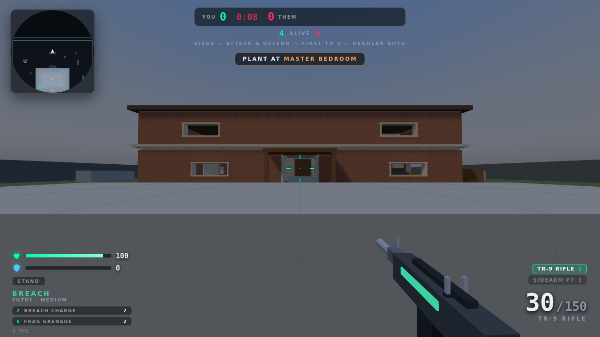
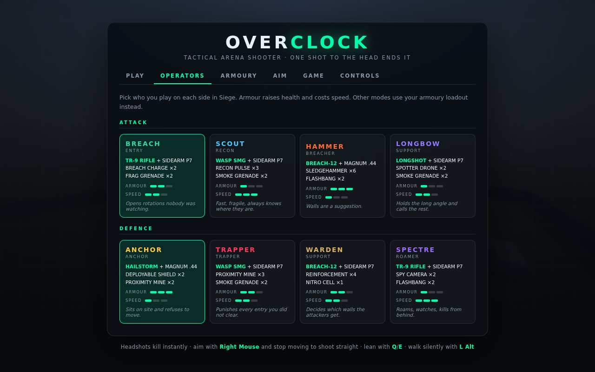
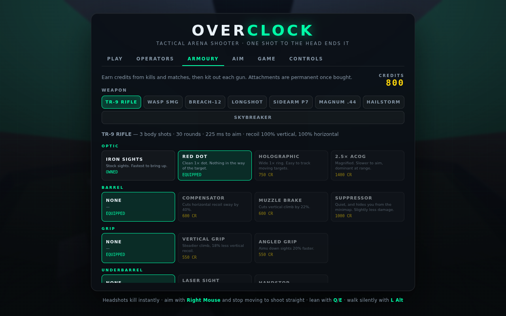
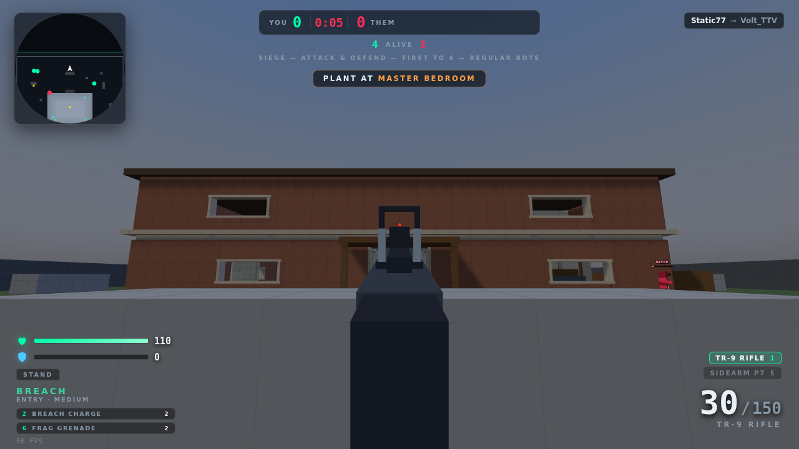

# OVERCLOCK — tactical FPS

A browser shooter built around aim and information, not movement tricks. Attack and defend
a two-storey house, with destructible walls, operators with unique kit, throwables, a
camera network, and bots that play the objective. Headshots kill instantly. No build step,
no downloads, no network — it runs from static files.




## Run it

```bash
npm start          # → http://localhost:8080
```

`serve.js` is a dependency-free static server and Three.js is vendored in `vendor/`, so the
game works completely offline. (`npm install` is only needed to run the tests.) You need a
local server rather than opening `index.html` directly, because the game is built from ES
modules.

## Siege — the main mode

Two teams of four in a house. **Attackers** come in from the yard and must plant the
defuser on the objective and hold it for 32 seconds. **Defenders** stop them, or pull the
defuser back out. Wiping the other side also wins the round, and defenders win the clock.
One life per round, sides swap every round, first to the round limit takes the match.

- **The house is destructible.** Interior walls are drywall panels: you can shoot *through*
  them (rounds lose power with each panel), blow doorways with a breach charge, or knock
  one out with a sledgehammer. Two ceiling hatches let you open the floor above. Everything
  is rebuilt between rounds.
- **Cameras.** Defenders can watch four fixed feeds with `B` — and while you are watching
  one, your body is standing still and exposed. Attackers can shoot the cameras out.
- **Prep phase.** Defenders set up while the attack holds outside; reinforce walls, place
  mines, drop shields, add a spy camera.
- **Death is not the end of your round** — you spectate a living teammate until it resolves.

## Operators



Four a side. Armour raises health and costs movement speed. Each one brings a unique
ability plus a throwable.

| Attack | Kit | Ability |
| --- | --- | --- |
| **Breach** | TR-9 + Sidearm, frags | Breach charge — blows a doorway through drywall |
| **Scout** | Wasp SMG + Sidearm, smoke | Recon pulse — outlines every enemy within 40 m for 5 s |
| **Hammer** | Breach-12 + Magnum, flashbangs | Sledgehammer — removes a wall panel in one swing |
| **Longbow** | Longshot + Sidearm, smoke | Spotter drone — throwable camera that also reveals nearby enemies |

| Defence | Kit | Ability |
| --- | --- | --- |
| **Anchor** | Hailstorm + Magnum, mines | Deployable shield — instant hard cover |
| **Trapper** | Wasp SMG + Sidearm, smoke | Proximity mines |
| **Warden** | Breach-12 + Sidearm, nitro cell | Reinforcement — hardens a soft wall |
| **Spectre** | TR-9 + Sidearm, flashbangs | Spy camera — sticks a new feed on any wall |

Gadgets: frag, smoke (blocks sight lines for everyone, bots included), flashbang (only
blinds you if you were looking at it), proximity mine, and a remote-detonated nitro cell.

## Armoury



Kills and matches pay credits. Spend them on permanent attachments, per weapon:

- **Optics** — iron sights, red dot, holographic, 2.5× ACOG. Each raises the sight line, and
  the ADS pose is derived from it, so the sight always lands dead centre and never covers
  your target.
- **Barrels** — compensator (−40% horizontal recoil), muzzle brake (−22% climb), suppressor
  (quiet, hides you from the minimap, slightly less damage).
- **Grips** — vertical (−18% vertical recoil) or angled (20% faster ADS).
- **Underbarrel** — laser sight (−35% hipfire spread) or handstop (faster while aimed).
- **Magazines** — extended (+35% rounds, slower reload) or quick mag (−25% reload).



## How it plays

- **One shot to the head ends it** — any bullet weapon, any range, through armour.
- **Bodies take 3–4 rounds.** Fights are decided by who saw whom first and who was aimed in.
- **Aimed and stationary is pin-point. Nothing else is.** Hipfire opens the cone ~50×,
  movement scales with your actual speed, and shooting mid-jump is useless.
- **Recoil is a fixed, learnable pattern** per weapon (±10% jitter), recovering to your
  original aim 0.12 s after you stop firing.
- **Walk 4.1 m/s, sprint 6.8, slide out of a sprint.** No bunny hopping, no air-strafing.
- **Leaning is a toggle** (`Q`/`E`, hold-mode available in settings) with no speed penalty —
  and it moves your head hitbox, so peeking is a real risk.
- **Sound is information.** Sprinting is loud, `Alt` walks silently, gunfire pulls bots in.

## Controls

Everything is rebindable — two slots per action, including fire and aim — in the **CONTROLS**
tab. Click a slot, press any key, mouse button or scroll direction; right-click to clear.


| Key | Action | | Key | Action |
| --- | --- | --- | --- | --- |
| `W A S D` | Move | | `Mouse 1` | Fire |
| `Shift` | Sprint | | `Mouse 2` | Aim down sights |
| `Alt` | Walk (silent) | | `R` | Reload |
| `Ctrl` | Crouch | | `V` | Melee |
| `C` | Slide (sprinting) | | `F` | Use / plant / defuse |
| `Space` | Jump | | `G` | Throw gadget |
| `Q` / `E` | Lean left / right | | `Z` | Operator ability |
| `Tab` | Scoreboard | | `B` | Camera feed |

## Aim settings

Built for people who care about their sensitivity: hipfire sens with a live **cm/360°**
readout (set your DPI so the number is real), separate **ADS** and **scope** multipliers,
**relative vs independent** zoom scaling, vertical/horizontal ratio, invert, raw input, and
hold-or-toggle for aim, crouch and lean.

## Other modes

- **Tactical** — one life per round, no objective, teams start apart.
- **Team deathmatch** — respawns on, friendly fire off.
- **Free for all** — everyone for themselves.
- **Gun game** — one kill per rung of a nine-weapon ladder, knife to finish. Floor weapons
  are removed in this mode: you only ever use the gun the ladder gives you.

## How the bots work

They run the same weapons, ballistics, physics and hitboxes you do — no instant hits, no
shooting through walls they cannot see through.

- **Perception** — vision cone plus line-of-sight raycasts, rescanned ~7×/second. Smoke
  blocks them, flashbangs blind them, and they hear gunfire within 42 m.
- **Aim** — the view turns toward a predicted point at a capped rate, offset by an error
  angle that grows with range and target speed and shrinks the longer they track you. They
  shoulder the weapon when engaging and stop moving when they are nearly on target.
- **Movement** — A\* over a multi-level nav grid built from the map, covering stairs,
  doorways and drops, with straight-line shortcutting and ledge probing. Blowing a wall
  relinks the grid, so destruction really does open new routes for them.
- **Objective play** — attacker bots push the site and plant; defenders hold it, defuse,
  fortify walls and place traps during prep.

| | Reaction | Aim error | Sight | Aims for the head |
| --- | --- | --- | --- | --- |
| Recruit | 0.50–0.90 s | 5.5° | 40 m | 2% |
| Regular | 0.30–0.52 s | 3.2° | 52 m | 8% |
| Veteran | 0.18–0.30 s | 1.8° | 66 m | 22% |
| Nightmare | 0.09–0.17 s | 0.95° | 85 m | 45% |

## Layout

```
index.html          markup for menus + HUD
style.css           all UI styling
serve.js            zero-dependency static server
src/
  main.js           boot, menus, rebinding UI, armoury, main loop
  core/             keybinds, input, settings (incl. cm/360), procedural audio
  world/
    house.js        the map: rooms, soft walls, hatches, objectives, cameras
    collision.js    AABB broadphase, raycasting, destruction, swept movement
    nav.js          multi-level nav grid, A*, incremental relinking
  entities/
    movement.js     stances, lean, slide — no bhop
    actor.js        health, armour, hitboxes, inventory, spread model
    player.js       look, sensitivity, lean, pattern recoil, gadgets, abilities
    bot.js          perception → decisions → aim → movement → objective
    botmodel.js     procedural animated humanoid + nametag
  weapons/
    defs.js         weapon stats and generated spray patterns
    attachments.js  attachment effects and the credit economy
    models.js       procedural guns, sights and attachment parts
    viewmodel.js    first-person animation, ADS pose derived from the sight
  game/
    game.js         match flow, spawning, cameras, operators, scoring
    siege.js        attack/defend rounds, plant and defuse
    operators.js    operator roster
    gadgets.js      throwables, deployables, abilities, smoke and flash effects
    combat.js       ballistics, wall penetration, explosions
  fx/effects.js     particles, tracers, decals, explosions
  ui/               HUD and minimap
test/smoke.mjs      headless integration tests
```

Nothing is loaded from a CDN and there are no image or audio files: the house, weapons,
characters, effects and every sound are generated in code.

## Multiplayer

Not built. The game is a pure static site, and a join code needs a server both players can
reach to match the code and relay traffic — which GitHub Pages cannot host — plus real
netcode (server-authoritative movement, interpolation, lag compensation). That is a project
in its own right rather than a setting to switch on.

## Tuning

- Weapon stats and spray patterns: `src/weapons/defs.js`.
- Attachments and prices: `src/weapons/attachments.js`.
- Operators: `src/game/operators.js`.
- Bot skill: `DIFFICULTY` in `src/entities/bot.js`.
- Movement feel: `MOVE` in `src/entities/movement.js`.
- The house: `buildHouse()` in `src/world/house.js` — `wallX`/`wallZ` take opening ranges,
  and anything marked breakable is built as destructible panels.

## Tests

```bash
npm install        # once, for Playwright
npm start          # in another shell
npm test
```

37 checks against the real game in headless Chromium: that every attacker spawn can path to
both objectives, wall penetration and destruction, nav relinking after a breach, all six
gadgets and abilities, plant/defuse, headshot lethality, TTK, the spread and recoil models,
attachments, the sight-line maths, cameras, all five modes running to completion, and the
frame budget with 15 Nightmare bots.
