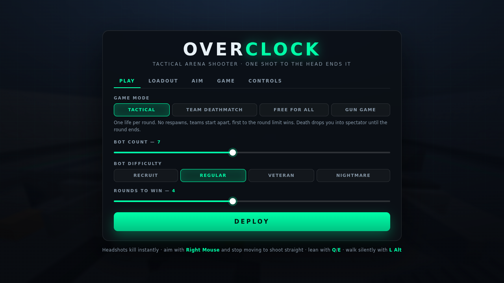
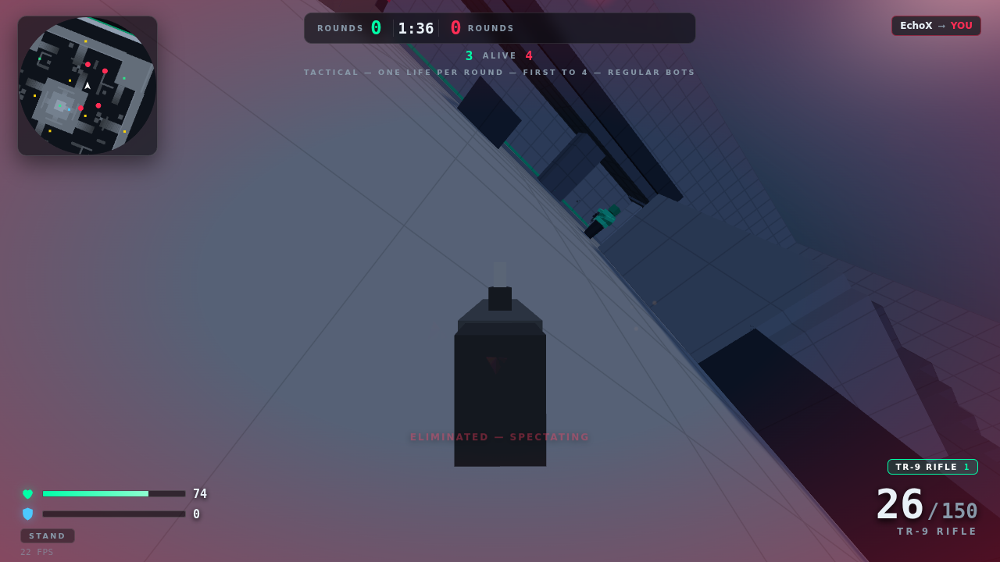
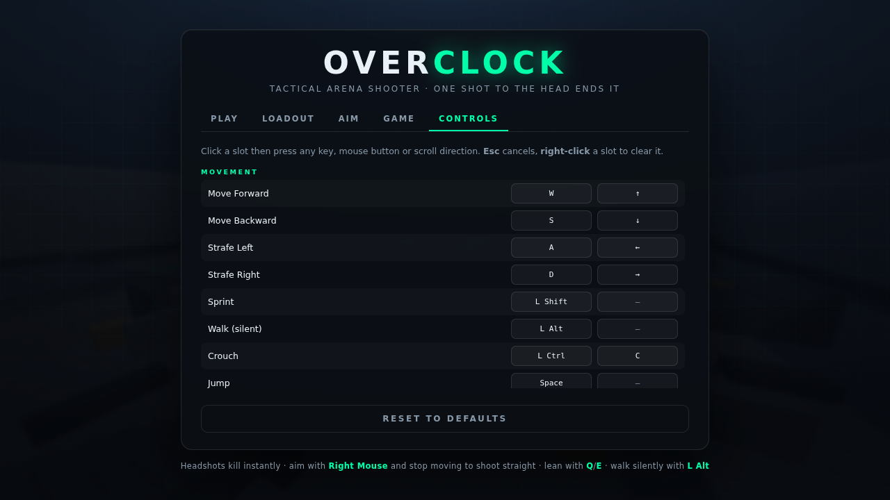

# OVERCLOCK — tactical arena FPS

A browser shooter built for aim, not for movement tricks. Headshots kill instantly, guns
are lethal in three or four body shots, and the bots hold angles, peek, aim in and shoot
back. No build step, no downloads, no network — it all runs from static files.




## Run it

```bash
npm start          # → http://localhost:8080
```

`serve.js` is a dependency-free static server and Three.js is vendored in `vendor/`, so the
game works completely offline. (`npm install` is only needed to run the tests.) You need a
local server rather than opening `index.html` directly, because the game is built from ES
modules.

## How it plays

It is deliberately slow and lethal:

- **One shot to the head ends it** — with any bullet weapon, at any range, through armour.
- **Bodies take 3–4 rounds.** Fights are decided by who saw whom first and who was already aimed in.
- **Aimed and stationary is pin-point. Nothing else is.** Hipfiring opens the cone ~50×,
  moving while aimed opens it further, and shooting mid-jump is close to useless.
- **Recoil is a fixed, learnable pattern** per weapon (with only ±10% jitter), so controlling
  a spray is a skill you practise. It recovers to where you were pointing 0.12 s after you
  stop firing.
- **You walk at 3.7 m/s and sprint at 6.** No bunny hopping, no air-strafing, no sliding —
  jumping just makes you an inaccurate, audible target.
- **Leaning** (`Q`/`E`) slides your camera *and your head hitbox* around cover, so peeking is
  a real risk/reward decision rather than a free look.
- **Sound is information.** Sprinting is loud, walking (`Alt`) is silent, and gunfire pulls
  bots toward you from 42 m away.

## Controls

Everything is rebindable — two slots per action, including fire and aim — in the **CONTROLS**
tab. Click a slot, press any key, mouse button or scroll direction; right-click a slot to
clear it.



Defaults:

| Key | Action | | Key | Action |
| --- | --- | --- | --- | --- |
| `W A S D` | Move | | `Mouse 1` | Fire |
| `Shift` | Sprint | | `Mouse 2` | Aim down sights |
| `Alt` | Walk (silent) | | `R` | Reload |
| `Ctrl` / `C` | Crouch | | `V` | Melee |
| `Space` | Jump | | `F` | Pick up weapon |
| `Q` / `E` | Lean left / right | | `1`–`8`, wheel | Switch weapon |
| `Tab` | Scoreboard | | `X` | Last weapon |

## Aim settings

The **AIM** tab is built for people who care about their sensitivity:

- **Hipfire sensitivity** with a live **cm/360°** readout (set your DPI so the number is real).
- Separate **ADS** and **scope** multipliers.
- **Zoom scaling**: *Relative* keeps on-screen tracking distance constant as the FOV narrows;
  *Independent* applies your multipliers raw.
- **Vertical/horizontal ratio**, invert, and a raw-input toggle (asks the browser for
  unaccelerated deltas).
- Hold-or-toggle for aim and crouch.

## Modes

- **Tactical** — one life per round, no respawns, teams start on opposite sides. Rounds open
  with a short prep freeze, and dying puts you in spectator on a living teammate until the
  round resolves. First to the round limit wins. Late in a round the survivors are pushed
  toward each other so nobody camps out the clock.
- **Team deathmatch** — two teams, respawns on, friendly fire off.
- **Free for all** — everyone for themselves.
- **Gun game** — one kill per rung of a nine-weapon ladder, knife to finish.

## Weapons

| Weapon | Class | Body shots | RPM | Mag | Notes |
| --- | --- | --- | --- | --- | --- |
| TR-9 Rifle | Assault | 3 | 700 | 30 | The benchmark: strong pattern, holds up at range |
| Wasp SMG | Submachine | 4 | 900 | 32 | Fastest handling, falls off hard past 16 m |
| Breach-12 | Shotgun | 1 close | 70 | 6 | 12 pellets, shell-by-shell reload you can interrupt |
| Longshot | Sniper | 1 | 40 | 5 | One-shot anywhere, but hipfire is a 7.5° cone |
| Sidearm P7 | Pistol | 4 | 380 | 15 | Quickest swap, tightest hipfire |
| Magnum .44 | Hand cannon | 2 | 150 | 6 | Two-tap, heavy kick |
| Hailstorm | Heavy | 4 | 720 | 60 | 60-round belt, 0.44 s to aim, slow to carry |
| Skybreaker | Explosive | — | 50 | 1 | Splash + knockback; rocket jumps still work |

Every gun is also on the ground somewhere. Health (+45), armour (+50, torso only) and ammo
crates respawn on timers.

## How the bots work

They run the same weapons, ballistics, physics and hitboxes you do — no instant hits, no
shooting through walls.

- **Perception** — a vision cone plus line-of-sight raycasts, rescanned ~7×/second. They hear
  gunfire within 42 m and snap toward whoever shot them from off-screen.
- **Aim** — the view turns toward a predicted point at a capped rate, offset by an error angle
  that grows with range and target speed and *shrinks the longer they track you*. A bot that
  has been watching you for a second is far deadlier than one that just spotted you. They
  only fire when the muzzle is genuinely on target and the line is clear of their own cover.
- **They aim in and settle.** Engaging bots shoulder the weapon (slower, more accurate) and
  stop moving when they are nearly on target, exactly like a player counter-strafing.
- **Movement** — A\* over a multi-level nav grid built from the map (2,600 nodes covering
  stairs, catwalks and drops), with straight-line shortcutting, ledge probing and stuck
  detection.
- **Tactics** — a preferred range per weapon, crouching to hold long angles, breaking line of
  sight to reload, hunting health when hurt, picking up guns when dry, knife rushes.

Four difficulty tiers:

| | Reaction | Aim error | Sight | Aims for the head | Uses cover |
| --- | --- | --- | --- | --- | --- |
| Recruit | 0.50–0.90 s | 5.5° | 40 m | 2% | rarely |
| Regular | 0.30–0.52 s | 3.2° | 52 m | 8% | sometimes |
| Veteran | 0.18–0.30 s | 1.8° | 66 m | 22% | often |
| Nightmare | 0.09–0.17 s | 0.95° | 85 m | 45% | almost always |

## Layout

```
index.html          markup for menus + HUD
style.css           all UI styling
serve.js            zero-dependency static server
src/
  main.js           boot, menu wiring, rebinding UI, main loop
  core/
    keybinds.js     action registry, defaults, persistence
    input.js        raw keyboard/mouse/wheel → bound actions
    settings.js     sensitivity model (incl. cm/360) and preferences
    audio.js        procedural positional WebAudio — no sound files
  world/
    collision.js    AABB broadphase, raycasting, swept character movement
    map.js          the arena, built from boxes + a world-space grid shader
    nav.js          nav grid generation and A*
  entities/
    movement.js     grounded tactical movement: stances, lean, no bhop
    actor.js        health, armour, hitboxes, inventory, spread model
    player.js       look, sensitivity, lean, pattern recoil, firing
    bot.js          perception → decisions → aim → movement → shooting
    botmodel.js     procedural animated humanoid + nametag
  weapons/          definitions + spray patterns, procedural models, viewmodel
  game/
    game.js         match flow, rounds, spawning, pickups, modes, scoring
    combat.js       ballistics shared by players and bots
  fx/effects.js     particles, tracers, decals, explosions
  ui/               HUD and minimap
test/smoke.mjs      headless integration tests
```

Nothing is loaded from a CDN and there are no image or audio files: the map, weapons,
characters, effects and every sound are generated in code.

## Tuning

- Weapon stats and spray patterns: `src/weapons/defs.js`.
- Bot skill: `DIFFICULTY` at the top of `src/entities/bot.js`.
- Movement feel: `MOVE` in `src/entities/movement.js`.
- Default keybinds: `ACTIONS` in `src/core/keybinds.js`.
- The arena: `buildMap()` in `src/world/map.js` — `B.box()` / `B.stairs()` calls, with
  `sym4()` mirroring anything onto all four sides.

## Tests

```bash
npm install        # once, for Playwright
npm start          # in another shell
npm test
```

30 checks against the real game in headless Chromium: traversal on every level of the map,
collision, rebinding through the actual capture path, cm/360 maths, movement pacing (and
that bunny hopping gains nothing), leaning exposing the head hitbox, one-shot headshots
through armour, body TTK, the spread and recoil models, all four modes running to
completion, and the frame budget with 15 Nightmare bots.
